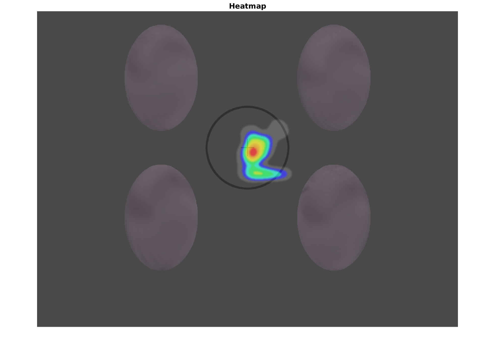

```{r setup, include=FALSE}

knitr::opts_chunk$set(echo = TRUE)
ls.packages = c("knitr",# kable
    "ggplot2",          # plots
    "tidyverse",        # tibble stuff
    "ggpubr",           # ggarrange
    "brms",             # Bayesian LMMs
    "ggrain",           # geom_rain
    "BayesFactor",      # anovaBF
    "effectsize",       # interpretBF
    "vtable",           # st summary tables
    "rstatix",          # shapiro_test
    "bayestestR"        # equivalence_test
)

lapply(ls.packages, library, character.only=TRUE)

# graph settings 
c_light = "#a9afb2"; c_light_highlight = "#8ea5b2"; c_mid = "#6b98b2" 
c_mid_highlight = "#3585b2"; c_dark = "#0072b2"; c_dark_highlight = "#0058b2" 
c_green = "#009E73"
sz = 1

# custom colour palette
custom.col = c(c_dark_highlight, c_green, "#CC79A7", "#D55E00")

# path to the models
model_dir = "./_brms_models"

```

# Packages and load data

```{r lib_versions, echo=F}

print(R.Version()$version.string)

for (package in ls.packages) {
  print(sprintf("%s version %s", package, packageVersion(package)))
}


# load the data
load(file.path(model_dir, "VMM_data.RData"))


# only keep the relevant rtcs
df.rtc.agg = df.tsk %>% 
  filter(sdt == "hit" & !is.na(rtc)) %>%
  group_by(subID, diagnosis) %>%
  summarise(
    rtc = median(rtc)
  ) %>% 
  ungroup() %>%
  mutate_if(is.character, as.factor)
df.disc = df.disc %>% 
  ungroup() %>%
  # subtract the discrimination rate from the "perfect" number to be able to 
  # use a poisson in the model
  mutate(
    negdisc = 240 - disc
  ) %>%
  mutate_if(is.character, as.factor)

```

# Participants

```{r part}

# print the group of included participants
kable(df.disc %>% select(subID, diagnosis) %>% distinct() %>% 
        group_by(diagnosis) %>% count())

# print the group of included participants with eye tracking
kable(df.fix.agg %>% select(subID, diagnosis) %>% distinct() %>% 
        group_by(diagnosis) %>% count())

# print the outcome of the contingency table concerning gender
ct.full@bayesFactor
ct.mf@bayesFactor

# print the outcome of the contingency table concerning education
ct.edu@bayesFactor

# print the associated table
kable(as.data.frame(tb.edu) %>% 
        pivot_wider(names_from = diagnosis, values_from = Freq) %>% 
        mutate(
          description = case_match(edu, 
                                   "1" ~ "No educational or vocational training", 
                                   "2" ~ "Middle school education", 
                                   "3" ~ "Trade school", 
                                   "4" ~ "High school education", 
                                   "5" ~ "University degree (Bachelor, Master, PhD)")
          )
      )

# print the outcome of the screening with ASRS and RADS
kable(tb.screen)

# print medication for the paper
kable(df.meds)

```

# Behavioural and eye-tracking results

```{r prep}

# load the models
m.rtc = readRDS(file.path(model_dir, "m_rtc_agg.rds"))
m.disc = readRDS(file.path(model_dir, "m_disc.rds"))

# set and print the contrasts
contrasts(df.rtc.agg$diagnosis)  = contr.sum(3)
contrasts(df.rtc.agg$diagnosis)
contrasts(df.disc$diagnosis) = contr.sum(3)
contrasts(df.disc$diagnosis)
contrasts(df.fix.agg$diagnosis) = contr.sum(3)
contrasts(df.fix.agg$diagnosis)

```

## Reaction times

### Model and inferences

```{r final, fig.height=3, fig.width=4}

# print a summary
summary(m.rtc)

# get the estimates and compute groups
df.m.rtc = as_draws_df(m.rtc) %>% 
  select(starts_with("b_")) %>%
  mutate(
    b_COMP    = - b_diagnosis1 - b_diagnosis2,
    b_ASD       = b_diagnosis2,
    b_ADHD      = b_diagnosis1
    )

# plot the posterior distributions
df.m.rtc %>% 
  select(b_ASD, b_ADHD, b_COMP) %>%
  pivot_longer(cols = c(b_ASD, b_ADHD, b_COMP), names_to = "coef", values_to = "estimate") %>% 
  group_by(coef) %>%
  mutate(
    cred = case_when(
      (mean(estimate) < 0 & quantile(estimate, probs = 0.975) < 0) |
        (mean(estimate) > 0 & quantile(estimate, probs = 0.025) > 0) ~ "credible",
      T ~ "not credible"
    )
  ) %>% ungroup() %>% 
  ggplot(aes(x = estimate, y = coef, fill = cred)) +
  geom_vline(xintercept = 0, linetype = 'dashed') +
  ggdist::stat_halfeye(alpha = 0.7) + ylab(NULL) + theme_bw() +
  scale_fill_manual(values = c(credible = c_dark, c_light)) + 
  theme(legend.position = "none")

# ADHD slower than COMP
e1 = hypothesis(m.rtc, "0 < 2*diagnosis1 + diagnosis2", alpha = 0.025)
e1

# ASD slower than COMP
e2 = hypothesis(m.rtc, "0 < 2*diagnosis2 + diagnosis1", alpha = 0.025)
e2

# extract predicted differences in ms instead of log data
df.new = df.rtc.agg %>% 
  select(diagnosis) %>% 
  distinct()
df.ms = as.data.frame(
  fitted(m.rtc, summary = F, 
               newdata = df.new %>% select(diagnosis), 
               re_formula = NA))
colnames(df.ms) = df.new$diagnosis

# calculate our difference columns
df.ms = df.ms %>%
  mutate(
    COMP_ADHD  = COMP - ADHD,
    COMP_ASD   = COMP - ASD
  )


```

Our Bayesian linear mixed model with the hit reaction times as the outcome and diagnostic status as a predictor showed no credible differences: COMP participants reacted similarly to the ADHD group (CI of COMP - ADHD: `r round(quantile(df.ms$COMP_ADHD, 0.025)[[1]], 2)` to `r round(quantile(df.ms$COMP_ADHD, 0.975)[[1]], 2)`ms, posterior probability = `r round(e1$hypothesis$Post.Prob*100, 2)`%) and the ASD group (CI of COMP - ASD: `r round(quantile(df.ms$COMP_ASD, 0.025)[[1]], 2)` to `r round(quantile(df.ms$COMP_ASD, 0.975)[[1]], 2)`ms, posterior probability = `r round(e2$hypothesis$Post.Prob*100, 2)`%). 

### Plots

```{r plot_rtc, fig.height=4}

# overall median reaction times
df.rtc.agg %>% 
  ggplot(aes(diagnosis, rtc, fill = diagnosis, colour = diagnosis)) + #
  geom_rain(rain.side = 'r',
boxplot.args = list(color = "black", outlier.shape = NA, show_guide = FALSE, alpha = 0.5),
violin.args = list(color = "black", outlier.shape = NA, alpha = 0.5),
boxplot.args.pos = list(
  position = ggpp::position_dodgenudge(x = 0, width = 0.3), width = 0.3
),
point.args = list(show_guide = FALSE, alpha = .5),
violin.args.pos = list(
  width = 0.6, position = position_nudge(x = 0.16)),
point.args.pos = list(position = ggpp::position_dodgenudge(x = -0.25, width = 0.1))) +
  ylim(0, 800) +
  scale_fill_manual(values = custom.col) +
  scale_color_manual(values = custom.col) +
  labs(title = "Median reaction times per subject", 
       x = "", 
       y = "reaction time (ms)") +
  theme_bw() + 
  theme(legend.position = "none", 
        plot.title = element_text(hjust = 0.5), 
        legend.direction = "horizontal", 
        text = element_text(size = 15))

```

## Discrimination rate

### Model and inferences

```{r final_disc, fig.height=3, fig.width=4}

# print a summary
summary(m.disc)

# get the estimates and compute groups
df.m.disc = as_draws_df(m.disc) %>% 
  select(starts_with("b_")) %>%
  mutate(
    b_COMP    = - b_diagnosis1 - b_diagnosis2,
    b_ASD       = b_diagnosis2,
    b_ADHD      = b_diagnosis1
    )

# plot the posterior distributions
df.m.disc %>% 
  select(b_ASD, b_ADHD, b_COMP) %>%
  pivot_longer(cols = c(b_ASD, b_ADHD, b_COMP), names_to = "coef", values_to = "estimate") %>% 
  group_by(coef) %>%
  mutate(
    cred = case_when(
      (mean(estimate) < 0 & quantile(estimate, probs = 0.975) < 0) |
        (mean(estimate) > 0 & quantile(estimate, probs = 0.025) > 0) ~ "credible",
      T ~ "not credible"
    )
  ) %>% ungroup() %>% 
  ggplot(aes(x = estimate, y = coef, fill = cred)) +
  geom_vline(xintercept = 0, linetype = 'dashed') +
  ggdist::stat_halfeye(alpha = 0.7) + ylab(NULL) + theme_bw() +
  scale_fill_manual(values = c(credible = c_dark, c_light)) + 
  theme(legend.position = "none")

# ADHD worse discrimination than COMP
e1 = hypothesis(m.disc, "0 < 2*diagnosis1 + diagnosis2", alpha = 0.025)
e1

# ASD worse discrimination than COMP
e2 = hypothesis(m.disc, "0 > 2*diagnosis2 + diagnosis1", alpha = 0.025)
e2

# extract predicted differences in ms instead of log data
df.new = df.disc %>% 
  select(diagnosis) %>% 
  distinct()
df.ms = as.data.frame(
  fitted(m.disc, summary = F, 
               newdata = df.new %>% select(diagnosis), 
               re_formula = NA))
colnames(df.ms) = df.new$diagnosis

# calculate our difference columns
df.ms = df.ms %>%
  mutate(
    COMP_ADHD  = COMP - ADHD,
    COMP_ASD   = COMP - ASD
  )


```

Our Bayesian linear mixed model with the negative discrimination rate (perfect discrimination rate - actual discrimination rate) as the outcome and diagnostic status as a predictor showed no credible differences: COMP participants reacted similarly to the ADHD group (CI of COMP - ADHD: `r round(quantile(df.ms$COMP_ADHD, 0.025)[[1]], 2)` to `r round(quantile(df.ms$COMP_ADHD, 0.975)[[1]], 2)`ms, posterior probability = `r round(e1$hypothesis$Post.Prob*100, 2)`%) and the ASD group (CI of COMP - ASD: `r round(quantile(df.ms$COMP_ASD, 0.025)[[1]], 2)` to `r round(quantile(df.ms$COMP_ASD, 0.975)[[1]], 2)`ms, posterior probability = `r round(e2$hypothesis$Post.Prob*100, 2)`%). 

### Plots

```{r plot_disc, fig.height=4}

# overall median reaction times
df.disc %>% 
  ggplot(aes(diagnosis, disc, fill = diagnosis, colour = diagnosis)) + #
  geom_rain(rain.side = 'r',
boxplot.args = list(color = "black", outlier.shape = NA, show_guide = FALSE, alpha = 0.5),
violin.args = list(color = "black", outlier.shape = NA, alpha = 0.5),
boxplot.args.pos = list(
  position = ggpp::position_dodgenudge(x = 0, width = 0.3), width = 0.3
),
point.args = list(show_guide = FALSE, alpha = .5),
violin.args.pos = list(
  width = 0.6, position = position_nudge(x = 0.16)),
point.args.pos = list(position = ggpp::position_dodgenudge(x = -0.25, width = 0.1))) +
  ylim(0, 240) +
  scale_fill_manual(values = custom.col) +
  scale_color_manual(values = custom.col) +
  labs(title = "Discrimination rate per subject", 
       x = "", 
       y = "") +
  theme_bw() + 
  theme(legend.position = "none", 
        plot.title = element_text(hjust = 0.5), 
        legend.direction = "horizontal", 
        text = element_text(size = 15))

```

## Analysis of fixation proportions to centre AOI

### Bayesian ANOVAs

```{r fix_aov}

# check which outcomes of interest are normally distributed
df.fix.agg %>% 
  group_by(diagnosis) %>%
  shapiro_test(fix.total, fix.prop, rfix.total, rfix.prop) %>%
  mutate(
    sig = if_else(p < 0.05, "*", "")
  ) %>% arrange(variable)

# ANOVA for the ranked proportional fixation durations
aov.fix = anovaBF(rfix.prop ~ diagnosis, data = df.fix.agg)
aov.fix@bayesFactor[["bf"]]
interpret_bf(aov.fix@bayesFactor[["bf"]], log = T)

# also explore if there are any differences in total fixation durations
aov.total = anovaBF(rfix.total ~ diagnosis, data = df.fix.agg)
aov.total@bayesFactor[["bf"]]
interpret_bf(aov.total@bayesFactor[["bf"]], log = T)

# print some info on the raw values
st(df.fix.agg, 
           vars = c('fix.centre', 'fix.periphery', 'fix.total', 'fix.prop'),
           group = 'diagnosis')

```


### Plots

```{r plot_fix, fig.height=4}

# overall
df.fix.agg %>% 
  ggplot(aes(diagnosis, fix.prop, fill = diagnosis, colour = diagnosis)) + #
  geom_rain(rain.side = 'r',
boxplot.args = list(color = "black", outlier.shape = NA, show_guide = FALSE, alpha = 0.5),
violin.args = list(color = "black", outlier.shape = NA, alpha = 0.5),
boxplot.args.pos = list(
  position = ggpp::position_dodgenudge(x = 0, width = 0.3), width = 0.3
),
point.args = list(show_guide = FALSE, alpha = .5),
violin.args.pos = list(
  width = 0.6, position = position_nudge(x = 0.16)),
point.args.pos = list(position = ggpp::position_dodgenudge(x = -0.25, width = 0.1))) +
  ylim(0.25, 1) +
  scale_fill_manual(values = custom.col) +
  scale_color_manual(values = custom.col) +
  labs(title = "Fixation proportions to centre of the screen", 
       x = "", 
       y = "% of fixation durations") +
  theme_bw() + 
  theme(legend.position = "none", 
        plot.title = element_text(hjust = 0.5), 
        legend.direction = "horizontal", 
        text = element_text(size = 15))

```

### Heatmaps

 


 


 

\newpage

# fMRPrep

Results included in this manuscript come from preprocessing
performed using *fMRIPrep* 23.0.2
(@fmriprep1; @fmriprep2; RRID:SCR_016216),
which is based on *Nipype* 1.8.6
(@nipype1; @nipype2; RRID:SCR_002502).

## Preprocessing of B<sub>0</sub> inhomogeneity mappings

A total of 2 fieldmaps were found available within the input BIDS structure for this particular subject. A *B<sub>0</sub>*-nonuniformity map (or *fieldmap*) was estimated based on two (or more) echo-planar imaging (EPI) references  with `topup` (@topup; FSL 6.0.5.1:57b01774).

## Anatomical data preprocessing

A total of 2 T1-weighted (T1w) images were found within the input BIDS dataset. All of them were corrected for intensity non-uniformity (INU) with `N4BiasFieldCorrection` [@n4], distributed with ANTs 2.3.3 [@ants, RRID:SCR_004757]. The T1w-reference was then skull-stripped with a *Nipype* implementation of the `antsBrainExtraction.sh` workflow (from ANTs), using OASIS30ANTs as target template. Brain tissue segmentation of cerebrospinal fluid (CSF), white-matter (WM) and gray-matter (GM) was performed on the brain-extracted T1w using `fast` [FSL 6.0.5.1:57b01774, RRID:SCR_002823, @fsl_fast]. An anatomical T1w-reference map was computed after registration of 2 T1w images (after INU-correction) using `mri_robust_template` [FreeSurfer 7.3.2, @fs_template]. Brain surfaces were reconstructed using `recon-all` [FreeSurfer 7.3.2, RRID:SCR_001847, @fs_reconall], and the brain mask estimated previously was refined with a custom variation of the method to reconcile ANTs-derived and FreeSurfer-derived segmentations of the cortical gray-matter of Mindboggle [RRID:SCR_002438, @mindboggle]. Volume-based spatial normalization to two standard spaces (MNI152NLin6Asym, MNI152NLin2009cAsym) was performed through nonlinear registration with `antsRegistration` (ANTs 2.3.3), using brain-extracted versions of both T1w reference and the T1w template. The following templates were were selected for spatial normalization and accessed with *TemplateFlow* [23.0.0, @templateflow]: *FSL's MNI ICBM 152 non-linear 6th Generation Asymmetric Average Brain Stereotaxic Registration Model* [@mni152nlin6asym, RRID:SCR_002823; TemplateFlow ID: MNI152NLin6Asym], *ICBM 152 Nonlinear Asymmetrical template version 2009c* [@mni152nlin2009casym, RRID:SCR_008796; TemplateFlow ID: MNI152NLin2009cAsym].

## Functional data preprocessing

For each of the 2 BOLD runs found per subject (across all tasks and sessions), the following preprocessing was performed. First, a reference volume and its skull-stripped version were generated  using a custom methodology of *fMRIPrep*. Head-motion parameters with respect to the BOLD reference (transformation matrices, and six corresponding rotation and translation parameters) are estimated before any spatiotemporal filtering using `mcflirt` [FSL 6.0.5.1:57b01774, @mcflirt]. The estimated *fieldmap* was then aligned with rigid-registration to the target EPI (echo-planar imaging) reference run. The field coefficients were mapped on to the reference EPI using the transform. BOLD runs were slice-time corrected to 1.18s (0.5 of slice acquisition range 0s-2.37s) using `3dTshift` from AFNI  [@afni, RRID:SCR_005927]. The BOLD reference was then co-registered to the T1w reference using `bbregister` (FreeSurfer) which implements boundary-based registration [@bbr]. Co-registration was configured with six degrees of freedom. Several confounding time-series were calculated based on the *preprocessed BOLD*: framewise displacement (FD), DVARS and three region-wise global signals. FD was computed using two formulations following Power (absolute sum of relative motions, @power_fd_dvars) and Jenkinson (relative root mean square displacement between affines, @mcflirt). FD and DVARS are calculated for each functional run, both using their implementations in *Nipype* [following the definitions by @power_fd_dvars]. The three global signals are extracted within the CSF, the WM, and the whole-brain masks. Additionally, a set of physiological regressors were extracted to allow for component-based noise correction [*CompCor*, @compcor]. Principal components are estimated after high-pass filtering the *preprocessed BOLD* time-series (using a discrete cosine filter with 128s cut-off) for the two *CompCor* variants: temporal (tCompCor) and anatomical (aCompCor). tCompCor components are then calculated from the top 2% variable voxels within the brain mask. For aCompCor, three probabilistic masks (CSF, WM and combined CSF+WM) are generated in anatomical space. The implementation differs from that of Behzadi et al. in that instead of eroding the masks by 2 pixels on BOLD space, a mask of pixels that likely contain a volume fraction of GM is subtracted from the aCompCor masks. This mask is obtained by dilating a GM mask extracted from the FreeSurfer's *aseg* segmentation, and it ensures components are not extracted from voxels containing a minimal fraction of GM. Finally, these masks are resampled into BOLD space and binarized by thresholding at 0.99 (as in the original implementation). Components are also calculated separately within the WM and CSF masks. For each CompCor decomposition, the *k* components with the largest singular values are retained, such that the retained components' time series are sufficient to explain 50 percent of variance across the nuisance mask (CSF, WM, combined, or temporal). The remaining components are dropped from consideration. The head-motion estimates calculated in the correction step were also placed within the corresponding confounds file. The confound time series derived from head motion estimates and global signals were expanded with the inclusion of temporal derivatives and quadratic terms for each [@confounds_satterthwaite_2013]. Frames that exceeded a threshold of 0.5 mm FD or 1.5 standardized DVARS were annotated as motion outliers. Additional nuisance timeseries are calculated by means of principal components analysis of the signal found within a thin band (*crown*) of voxels around the edge of the brain, as proposed by [@patriat_improved_2017]. The BOLD time-series were resampled into standard space, generating a *preprocessed BOLD run in MNI152NLin6Asym space*. First, a reference volume and its skull-stripped version were generated  using a custom methodology of *fMRIPrep*. Automatic removal of motion artifacts using independent component analysis [ICA-AROMA, @aroma] was performed on the *preprocessed BOLD on MNI space* time-series after removal of non-steady state volumes and spatial smoothing with an isotropic, Gaussian kernel of 6mm FWHM (full-width half-maximum). Corresponding "non-aggresively" denoised runs were produced after such smoothing. Additionally, the "aggressive" noise-regressors were collected and placed in the corresponding confounds file. All resamplings can be performed with *a single interpolation step* by composing all the pertinent transformations (i.e. head-motion transform matrices, susceptibility distortion correction when available, and co-registrations to anatomical and output spaces). Gridded (volumetric) resamplings were performed using `antsApplyTransforms` (ANTs), configured with Lanczos interpolation to minimize the smoothing effects of other kernels [@lanczos]. Non-gridded (surface) resamplings were performed using `mri_vol2surf` (FreeSurfer). 

Many internal operations of *fMRIPrep* use *Nilearn* 0.9.1 [@nilearn, RRID:SCR_001362], mostly within the functional processing workflow. For more details of the pipeline, see [the section corresponding to workflows in *fMRIPrep*'s documentation](https://fmriprep.readthedocs.io/en/latest/workflows.html "FMRIPrep's documentation").

### Copyright Waiver

The above boilerplate text was automatically generated by fMRIPrep with the express intention that users should copy and paste this text into their manuscripts *unchanged*. It is released under the [CC0](https://creativecommons.org/publicdomain/zero/1.0/) license.

### References

Abraham, Alexandre, Fabian Pedregosa, Michael Eickenberg, Philippe Gervais, Andreas Mueller, Jean Kossaifi, Alexandre Gramfort, Bertrand Thirion, and Gael Varoquaux. 2014. “Machine Learning for Neuroimaging with Scikit-Learn.” Frontiers in Neuroinformatics 8. https://doi.org/10.3389/fninf.2014.00014.

Andersson, Jesper L. R., Stefan Skare, and John Ashburner. 2003. “How to Correct Susceptibility Distortions in Spin-Echo Echo-Planar Images: Application to Diffusion Tensor Imaging.” NeuroImage 20 (2): 870–88. https://doi.org/10.1016/S1053-8119(03)00336-7.

Avants, B. B., C. L. Epstein, M. Grossman, and J. C. Gee. 2008. “Symmetric Diffeomorphic Image Registration with Cross-Correlation: Evaluating Automated Labeling of Elderly and Neurodegenerative Brain.” Medical Image Analysis 12 (1): 26–41. https://doi.org/10.1016/j.media.2007.06.004.

Behzadi, Yashar, Khaled Restom, Joy Liau, and Thomas T. Liu. 2007. “A Component Based Noise Correction Method (CompCor) for BOLD and Perfusion Based fMRI.” NeuroImage 37 (1): 90–101. https://doi.org/10.1016/j.neuroimage.2007.04.042.

Ciric, R., William H. Thompson, R. Lorenz, M. Goncalves, E. MacNicol, C. J. Markiewicz, Y. O. Halchenko, et al. 2022. “TemplateFlow: FAIR-Sharing of Multi-Scale, Multi-Species Brain Models.” Nature Methods 19: 1568–71. https://doi.org/10.1038/s41592-022-01681-2.

Cox, Robert W., and James S. Hyde. 1997. “Software Tools for Analysis and Visualization of fMRI Data.” NMR in Biomedicine 10 (4-5): 171–78. https://doi.org/10.1002/(SICI)1099-1492(199706/08)10:4/5<171::AID-NBM453>3.0.CO;2-L.

Dale, Anders M., Bruce Fischl, and Martin I. Sereno. 1999. “Cortical Surface-Based Analysis: I. Segmentation and Surface Reconstruction.” NeuroImage 9 (2): 179–94. https://doi.org/10.1006/nimg.1998.0395.

Esteban, Oscar, Ross Blair, Christopher J. Markiewicz, Shoshana L. Berleant, Craig Moodie, Feilong Ma, Ayse Ilkay Isik, et al. 2018. “fMRIPrep 23.0.2.” Software. https://doi.org/10.5281/zenodo.852659.

Esteban, Oscar, Christopher Markiewicz, Ross W Blair, Craig Moodie, Ayse Ilkay Isik, Asier Erramuzpe Aliaga, James Kent, et al. 2019. “fMRIPrep: A Robust Preprocessing Pipeline for Functional MRI.” Nature Methods 16: 111–16. https://doi.org/10.1038/s41592-018-0235-4.

Evans, AC, AL Janke, DL Collins, and S Baillet. 2012. “Brain Templates and Atlases.” NeuroImage 62 (2): 911–22. https://doi.org/10.1016/j.neuroimage.2012.01.024.

Fonov, VS, AC Evans, RC McKinstry, CR Almli, and DL Collins. 2009. “Unbiased Nonlinear Average Age-Appropriate Brain Templates from Birth to Adulthood.” NeuroImage 47, Supplement 1: S102. https://doi.org/10.1016/S1053-8119(09)70884-5.

Gorgolewski, K., C. D. Burns, C. Madison, D. Clark, Y. O. Halchenko, M. L. Waskom, and S. Ghosh. 2011. “Nipype: A Flexible, Lightweight and Extensible Neuroimaging Data Processing Framework in Python.” Frontiers in Neuroinformatics 5: 13. https://doi.org/10.3389/fninf.2011.00013.

Gorgolewski, Krzysztof J., Oscar Esteban, Christopher J. Markiewicz, Erik Ziegler, David Gage Ellis, Michael Philipp Notter, Dorota Jarecka, et al. 2018. “Nipype.” Software. https://doi.org/10.5281/zenodo.596855.

Greve, Douglas N, and Bruce Fischl. 2009. “Accurate and Robust Brain Image Alignment Using Boundary-Based Registration.” NeuroImage 48 (1): 63–72. https://doi.org/10.1016/j.neuroimage.2009.06.060.

Jenkinson, Mark, Peter Bannister, Michael Brady, and Stephen Smith. 2002. “Improved Optimization for the Robust and Accurate Linear Registration and Motion Correction of Brain Images.” NeuroImage 17 (2): 825–41. https://doi.org/10.1006/nimg.2002.1132.

Klein, Arno, Satrajit S. Ghosh, Forrest S. Bao, Joachim Giard, Yrjö Häme, Eliezer Stavsky, Noah Lee, et al. 2017. “Mindboggling Morphometry of Human Brains.” PLOS Computational Biology 13 (2): e1005350. https://doi.org/10.1371/journal.pcbi.1005350.

Lanczos, C. 1964. “Evaluation of Noisy Data.” Journal of the Society for Industrial and Applied Mathematics Series B Numerical Analysis 1 (1): 76–85. https://doi.org/10.1137/0701007.

Patriat, Rémi, Richard C. Reynolds, and Rasmus M. Birn. 2017. “An Improved Model of Motion-Related Signal Changes in fMRI.” NeuroImage 144, Part A (January): 74–82. https://doi.org/10.1016/j.neuroimage.2016.08.051.

Power, Jonathan D., Anish Mitra, Timothy O. Laumann, Abraham Z. Snyder, Bradley L. Schlaggar, and Steven E. Petersen. 2014. “Methods to Detect, Characterize, and Remove Motion Artifact in Resting State fMRI.” NeuroImage 84 (Supplement C): 320–41. https://doi.org/10.1016/j.neuroimage.2013.08.048.

Pruim, Raimon H. R., Maarten Mennes, Daan van Rooij, Alberto Llera, Jan K. Buitelaar, and Christian F. Beckmann. 2015. “ICA-AROMA: A Robust ICA-Based Strategy for Removing Motion Artifacts from fMRI Data.” NeuroImage 112 (Supplement C): 267–77. https://doi.org/10.1016/j.neuroimage.2015.02.064.

Reuter, Martin, Herminia Diana Rosas, and Bruce Fischl. 2010. “Highly Accurate Inverse Consistent Registration: A Robust Approach.” NeuroImage 53 (4): 1181–96. https://doi.org/10.1016/j.neuroimage.2010.07.020.

Satterthwaite, Theodore D., Mark A. Elliott, Raphael T. Gerraty, Kosha Ruparel, James Loughead, Monica E. Calkins, Simon B. Eickhoff, et al. 2013. “An improved framework for confound regression and filtering for control of motion artifact in the preprocessing of resting-state functional connectivity data.” NeuroImage 64 (1): 240–56. https://doi.org/10.1016/j.neuroimage.2012.08.052.

Tustison, N. J., B. B. Avants, P. A. Cook, Y. Zheng, A. Egan, P. A. Yushkevich, and J. C. Gee. 2010. “N4itk: Improved N3 Bias Correction.” IEEE Transactions on Medical Imaging 29 (6): 1310–20. https://doi.org/10.1109/TMI.2010.2046908.

Zhang, Y., M. Brady, and S. Smith. 2001. “Segmentation of Brain MR Images Through a Hidden Markov Random Field Model and the Expectation-Maximization Algorithm.” IEEE Transactions on Medical Imaging 20 (1): 45–57. https://doi.org/10.1109/42.906424.

# FSL analysis 

## Regions of interest

We created two masks containing regions of interest, one only containing the bilateral fusiform gyrus, the other additionally containing the following regions: ACC_pre_L, ACC_pre_R, ACC_sub_L, ACC_sub_R, ACC_sup_L, ACC_sup_R, Amygdala_L, Amygdala_R, Insula_L, Insula_R, Precuneus_L, Precuneus_R, SupraMarginal_R and Temporal_Rup_R. All regions were extracted from the AAL3 atlas. 

The ROI mask only containing the fusiform gyri was used to assess the colour prediction errors in the comparison group, as well as group differences in neural correlates of colour prediction errors. The other ROI mask was used to evaluate all other hypotheses, including emotion prediction error and prediction strength in the comparison group as well as the pooled sample and group differences in neural correlates of emotion prediction errors. 

## Combine FSL output

```{r table, message=FALSE}

# get one type of input from each contrast
ls.files = dir(pattern = '.*MNI-AAL.csv', path = "./results_sig")

for (file in ls.files) {
  contrast = gsub("_MNI-AAL.csv", "", file)
  type     = substr(contrast, nchar(contrast)-5, nchar(contrast)-5)
  maxima   = read_csv(file.path("results_sig", file), show_col_types = F)
  if (nrow(maxima) == 0) next
  summary  = read_delim(file.path("results_sig", 
                                  paste0(contrast, '_cluster-summary.txt')), 
                        show_col_types = F)
  output   = read_delim(file.path("results_sig", 
                                  paste0(contrast, '_randomise_output_all.txt')), 
                        show_col_types = F)
  
  relinfo  = 
    merge(
      output %>% select(`Cluster Index`, Voxels), 
      maxima %>% select(`Cluster Index`, `Value`, MNIx, MNIy, MNIz, AALname)
      ) %>%
    mutate(
      H = if_else(MNIx >= 0, "R", "L")
    ) %>%
    rename(
      `Cluster size` = "Voxels", 
      "Region" = "AALname",
      "x" = "MNIx",
      "y" = "MNIy",
      "z" = "MNIz"
    ) %>%
    arrange(desc(`Cluster Index`), desc(Value)) %>%
    relocate(`Cluster Index`, Region, `Cluster size`, H)
  colnames(relinfo)[colnames(relinfo) == "Value"] = paste0(type, "-value")
  
  write_csv(relinfo, file = file.path("results_sig", paste0(contrast, '.csv')))
  
}

```

## Hypothesis-guided ROI analysis

```{r hypo}

# COMP: same areas as Stefanics et al. (2019), Neuroimage

read_csv(file.path("results_sig", 'hgf_ctr_eps_c_ROI_fstat1.csv'), show_col_types = F) %>%
  kable(., caption = 'COMP: colour prediction error')

read_csv(file.path("results_sig", 'hgf_ctr_mu_e_ROI_fstat1.csv'), show_col_types = F) %>%
  kable(., caption = 'COMP: emotion prediction strength')

# pooled: same areas as Stefanics et al. (2019), Neuroimage

read_csv(file.path("results_sig", 'hgf_all_eps_c_ROI_fstat1.csv'), show_col_types = F) %>%
  kable(., caption = 'Pooled: colour prediction error')

read_csv(file.path("results_sig", 'hgf_all_mu_c_ROI_fstat1.csv'), show_col_types = F) %>%
  kable(., caption = 'Pooled: colour prediction strength')

read_csv(file.path("results_sig", 'hgf_all_mu_e_ROI_fstat1.csv'), show_col_types = F) %>%
  kable(., caption = 'Pooled: emotion prediction strength')

# Neural adaptation

read_csv(file.path("results_sig", 'smp_adapt_neg_ROI_tstat1.csv'), show_col_types = F) %>%
  kable(., caption = 'ALL: repetition suppression')

```

## Plotting

Plot the participants' activation in clusters larger than 100 voxels to visualise the effects. 

```{r plot}

# custom colour palette
custom.col = c("#009E73", "#D55E00", "#0058b2", "#CC79A7")

# load in the extracted activation
df.act = read_csv(file.path("fMRI_data", "grp_use-sorted.csv"), 
                  show_col_types = F) %>%
  mutate(
    diagnosis = fct_recode(diagnosis, 
                           "COMP" = "CTR")
  ) %>%
  select(diagnosis) %>%
  mutate(
    # load zstats for eps-c
    `colour pwPE-rFG`  = scan(file.path("fMRI_data", "eps_c_C7_meants.txt")),
    `colour pwPE-rSTS` = scan(file.path("fMRI_data", "eps_c_C6_meants.txt")),
    `colour pwPE-rINS` = scan(file.path("fMRI_data", "eps_c_C5_meants.txt")),
    `colour pwPE-rACC` = scan(file.path("fMRI_data", "eps_c_C4_meants.txt")),
    # load zstats for mu-z
    `colour PS-rINS`  = scan(file.path("fMRI_data", "mu_c_C3_meants.txt")),
    `colour PS-lINS`  = scan(file.path("fMRI_data", "mu_c_C4_meants.txt")),
    `colour PS-rACC`  = scan(file.path("fMRI_data", "mu_c_C5_meants.txt")),
    `colour PS-rSMG`  = scan(file.path("fMRI_data", "mu_c_C6_meants.txt")),
    `colour PS-PRC`   = scan(file.path("fMRI_data", "mu_c_C7_meants.txt")),
    # load zstats for mu-e
    `emotion PS-rPRC`  = scan(file.path("fMRI_data", "mu_e_C4_meants.txt")),
    `emotion PS-rFG`   = scan(file.path("fMRI_data", "mu_e_C3_meants.txt")),
    `emotion PS-lFG`   = scan(file.path("fMRI_data", "mu_e_C2_meants.txt")),
    # load zstat for neural adaptation
    `RS-rFG`  = scan(file.path("fMRI_data", "adapt_meants.txt"))
  ) %>%
  pivot_longer(cols = -diagnosis, names_to = c("parameter", "region"), 
               names_sep = "-", values_to = "activation")

# plot 
p = df.act %>%
  ggplot(aes(region, activation, fill = diagnosis, colour = diagnosis)) + #
  geom_rain(rain.side = 'r',
boxplot.args = list(color = "black", outlier.shape = NA, show.legend = FALSE, alpha = .8),
violin.args = list(color = "black", outlier.shape = NA, alpha = .6),
boxplot.args.pos = list(
  position = ggpp::position_dodgenudge(x = 0, width = 0.3), width = 0.3
),
point.args = list(show_guide = FALSE, alpha = .5, size = 0.5),
violin.args.pos = list(
  width = 0.6, position = position_nudge(x = 0.16)),
point.args.pos = list(position = ggpp::position_dodgenudge(x = -0.25, width = 0.1))) +
  scale_fill_manual(values = custom.col) +
  scale_color_manual(values = custom.col) +
  labs(title = "Neural correlates", x = "", y = "z-stat") + 
  facet_grid(. ~ parameter, scales = "free", space = "free") +
  geom_hline(yintercept = 0) +
  theme_bw() + 
  theme(legend.position = "bottom", 
        plot.title = element_text(hjust = 0.5), 
        legend.direction = "horizontal", 
        legend.title = element_blank(),
        text = element_text(size = 20, family = "Helvetica"),
        legend.box.margin = margin(-20,0, 0, 0)
        )

ggsave("neural_zstat.tiff", plot = p,
       units  = "mm", width  = 270, height = 100, dpi    = 300)

```

```{r bf_groups, warning=F, message=F}

# check normal distribution
df.act %>% group_by(diagnosis, parameter, region) %>%
  shapiro_test(activation) %>%
  arrange(region, parameter)

# not: colour PE - rACC, rINS, but most are
df.act = df.act %>%
  mutate(
    param_region = paste0(parameter, '_', region)
  )

# compute bayes factor using anovas
bf.log = c()
comb   = c()
for (c in unique(df.act$param_region)) {
  df.small = df.act %>% filter(param_region == c)
  aov = anovaBF(activation ~ diagnosis, data = df.small)
  comb   = c(comb, c)
  bf.log = c(bf.log, aov@bayesFactor$bf)
}

# apply multiple comparison correction after Westfall (1997)
# as described by de Jong (2019)
m = 6 # output of ceil(max(roots([1, -1, -28]))) in MATLAB
c = 0.5^(2/m);
podds = exp(bf.log) * ((1-c)/c)
bf.cor = c()
for (i in 1:length(bf.log)) {
  ph1    = podds[i]/(1 + podds[i])
  bf.cor = c(bf.cor, log(ph1/(1 - ph1)))
}

# put everything into a dataframe
df.aov = data.frame(comb, bf.log, bf.cor) %>%
  separate(comb, into = c("parameter", "region"), sep = "_") %>%
  mutate(
    interpretation = interpret_bf(bf.cor, log = T)
  )

kable(df.aov %>% arrange(bf.cor))


```

## Focusing on fusiform gyrus

```{r fusiform}

# load in the extracted activation
df.fg = read_csv(file.path("fMRI_data", "grp_use-sorted.csv"), 
                  show_col_types = F) %>%
  mutate(
    diagnosis = fct_recode(diagnosis, 
                           "COMP" = "CTR")
  ) %>%
  select(diagnosis) %>%
  mutate(
    # load zstats for eps-c
    `colour pwPE`   = scan(file.path("fMRI_data", "eps_c_rFG_meants.txt")),
    # load zstats for eps-e
    `emotion pwPE`  = scan(file.path("fMRI_data", "eps_e_rFG_meants.txt")),
    ) %>%
  pivot_longer(cols = -diagnosis, names_to = "parameter", values_to = "activation") %>%
  mutate_if(is.character, as.factor)


# check normal distribution
df.fg %>% group_by(diagnosis, parameter) %>%
  shapiro_test(activation) %>%
  arrange(parameter)

aov.pwPE = anovaBF(activation ~ diagnosis * parameter, data = df.fg)

# multiple comparison correction
bf.log = aov.pwPE@bayesFactor$bf
podds = exp(bf.log) * ((1-c)/c)
bf.cor = c()
for (i in 1:length(bf.log)) {
  ph1    = podds[i]/(1 + podds[i])
  bf.cor = c(bf.cor, log(ph1/(1 - ph1)))
}

as.data.frame(aov.pwPE@bayesFactor) %>%
  select(bf) %>%
  mutate(
    bf.cor = bf.cor
  ) %>%
  arrange(desc(bf.cor)) %>%
  mutate(
    null.int = interpret_bf(bf.cor, log = T),
    next.int = interpret_bf(bf.cor - lead(bf.cor), log = T)
  )

# plot 
df.fg %>%
  ggplot(aes(parameter, activation, fill = diagnosis, colour = diagnosis)) + #
  geom_rain(rain.side = 'r',
boxplot.args = list(color = "black", outlier.shape = NA, show.legend = FALSE, alpha = .8),
violin.args = list(color = "black", outlier.shape = NA, alpha = .6),
boxplot.args.pos = list(
  position = ggpp::position_dodgenudge(x = 0, width = 0.3), width = 0.3
),
point.args = list(show_guide = FALSE, alpha = .5, size = 0.5),
violin.args.pos = list(
  width = 0.6, position = position_nudge(x = 0.16)),
point.args.pos = list(position = ggpp::position_dodgenudge(x = -0.25, width = 0.1))) +
  scale_fill_manual(values = custom.col) +
  scale_color_manual(values = custom.col) +
  labs(title = "Right fusiform gyrus", x = "", y = "z-stat") + 
  geom_hline(yintercept = 0) +
  theme_bw() + 
  theme(legend.position = "bottom", 
        plot.title = element_text(hjust = 0.5), 
        legend.direction = "horizontal", 
        legend.title = element_blank(),
        text = element_text(size = 15, family = "Helvetica")
        )

ggsave("rFG_zstat.tiff",
       units  = "mm", width  = 170, height = 100, dpi    = 300)

```